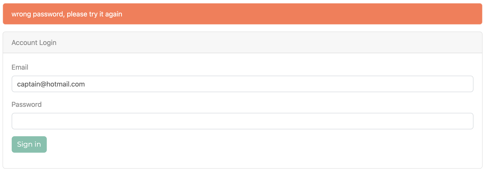

# Login Practice

Login Practice to go through authentication logic on application

## Feature

- pre-canned list of username and password
- when user enter email/password check if user exist
- if unable to find detial, redirect back to previous page and show correspond error message

## Getting Started

Clone repository

    git clone https://github.com/heidichen90/expense-tracker.git

Install Dependancies

    npm install

Spin up server

if you have nodemon

    npm run dev

if you dont have nodemon

    npm run start

The website should start running on

    http://localhost:3000/

Load up seed data

    npm run seed

## Built With

- [Node.js](https://nodejs.org/en/) (v10.15.0)
- [Express](https://expressjs.com/) (v4.17.1)
- [Express-Handlebars](https://www.npmjs.com/package/express-handlebars) (v5.3.2)
- [Bootstrap](https://getbootstrap.com/) (v4.3.1)
- [Mongoose ODM](https://mongoosejs.com/) (v5.12.13)
- [Mongodb](https://www.mongodb.com/) (v4.2.14)

## Author

Heidi Chen
